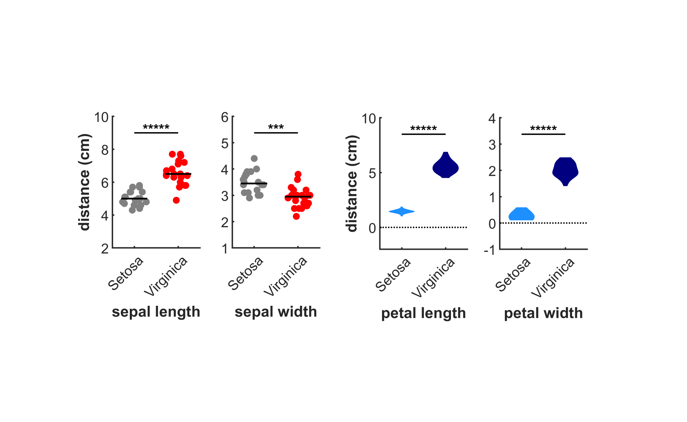

# statTest
Basic representations of two data groups as stripcharts and violin plots.  Mann-Whitney U test and t-test are performed with significance level indicators.

Dot plots and violin plots are described here, respectively:

L. Wilkinson, "Dot plots," The American Statistician, vol. 53, no. 3, pp. 276-281, 1999.

J. L. Hintze and R. D. Nelson, "Violin plots: a box plot-density trace synergism," The American Statistician, vol. 52, no. 2, pp. 181-184, 1998.

usage:

```matlab
call_statTest()
```

Cite As

Bélanger Nzakimuena, C. (2020). Automated Analysis of Retinal and Choroidal OCT and OCTA Images in AMD (Masters thesis, Polytechnique Montréal). Retrieved from https://publications.polymtl.ca/5234/


